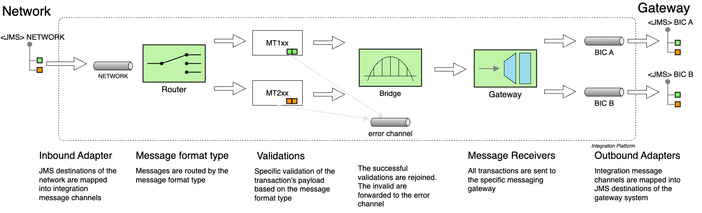

## Spring-boot Integration JMS Payments

Demo usage of Spring Integration DLS with Fluent Builder API.  
The integration flow implements a simple banking payment scenario simulating a **messaging hub** which send transactions from a mapped **network** to a **gateway**.  
JMS adaptors are connected to the integration flow working with ArtemisQM JMS destinations.



### Simple flow
- Send a transaction message to JMS _network_ destination
- The integration flow enrich the header
- The message is routed by the _format message type_ for validation 
- A bridge connection merge all the specific flows into gateway
- For each destination _(BIC/SWIFT code)_, the gateway forward the message to the specific JMS destination

### CLI

##### verify
```shell
mvn clean verify
```

##### run demo
```shell
mvn clean install -DskipTests spring-boot:run 
```
